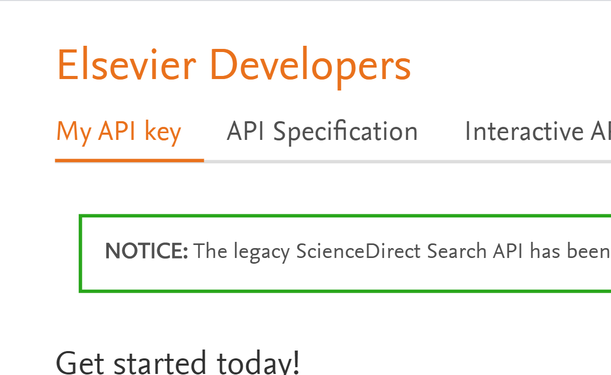
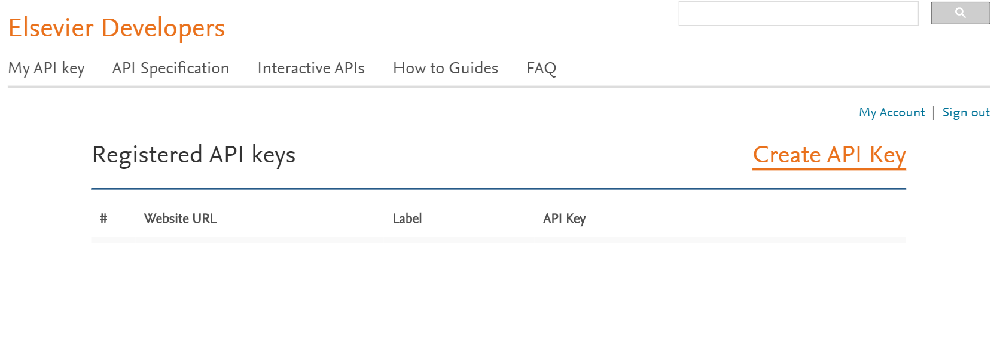
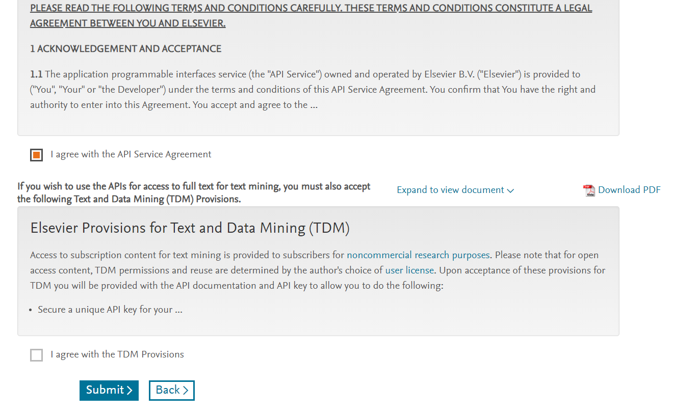
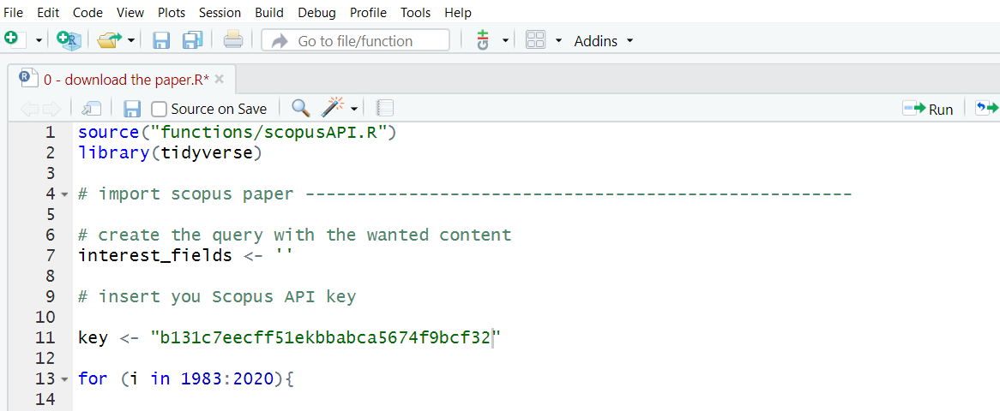

# scientific-paper-analysis
This repo contains code and functions for the analysis of scientific papers with R. 

# Download your own Scopus API key
To start with your own project on scientific paper you must download your Scoups API key. For downoloading your own API key you must follow these steps:
1. Create an account of Elsevier. You can create your account in this web page https://checkout.elsevier.com/auth. Remember you must use your institutional email
2. Go in the following web page of Elsevier https://dev.elsevier.com/
3. Click on "My API key" as shown in figure:

4. Now you are in this page https://dev.elsevier.com/apikey/manage and click on "Create API key" as shown in figure:

5. Accept the API Service Agreement and click on "Submit" as shown in figure:

6. Now you have created your API kew, that is available on https://dev.elsevier.com/apikey/manage. A key is a alphanumeric string with 32 charachters (e.g b131c7eecff51ekbbabca5674f9bcf32).
7. To use your API key you must insert it in R script "0 - download the paper". The API key is an argument of the function "searchByString". You can insert your own API key in "key" variable, as shown in the following figure:

8. Now your are ready for practice. Let's go.

